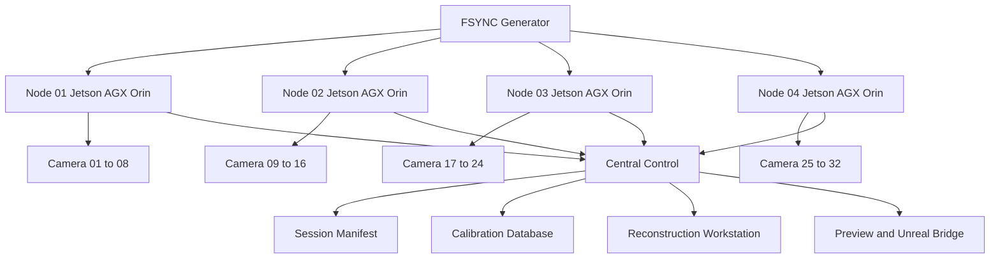

# 01 System Overview

## 1. コンセプト

本システムは、多台数global shutterカメラを同期させ、人間、物体、パフォーマンス、空間をvolumetric capture、photogrammetry、Gaussian Splatting、NeRF、AI解析、Unreal連携に利用するための自作capture platformである。

重要なのは、これは「映像制作機材」ではなく「時間同期されたマルチモーダル計測空間」だということ。

## 2. 目標

### Phase 1

8台の同期カメラノードを構築し、以下を成立させる。

| 成果 | 条件 |
|---|---|
| 同時露光 | 外部FSYNCで8台の露光開始を揃える |
| 同時保存 | 全カメラを同一session id、frame idで記録 |
| 再構成 | COLMAPまたはOpenMVGでcamera poseを推定 |
| dense geometry | OpenMVSまたはdepth pipelineで点群生成 |
| Gaussian Splatting | Nerfstudioまたはgsplatで3DGSを作成 |
| preview | 低解像度previewを30fps以上で確認 |
| metadata | カメラ、レンズ、露光、時刻、FSYNC情報を保存 |

### Phase 2

8台ノードを4式以上に増やし、32台から64台のcapture domeへ拡張する。

### Phase 3

リアルタイムpreview、body segmentation、depth inference、Unreal連携、LEDまたは音響システムとの同期へ進む。

## 3. 非目標

初期PoCでは以下を狙わない。

| 非目標 | 理由 |
|---|---|
| 完全リアルタイムvolumetric再構成 | 初期段階でこれを狙うと同期検証が曖昧になる |
| 4K多台数RAW | 帯域と保存が一気に破綻しやすい |
| Sony αやFX系の多台数同期 | 露光同期、熱、電源、制御、レンズ固定が弱い |
| H264だけの記録 | photogrammetryとGaussian Splattingで圧縮アーティファクトが問題になる |
| GUI中心の運用 | 再現性、remote operation、自動化に弱い |

## 4. 基本思想

### 4.1 カメラはセンサー

カメラを「映像を撮る機械」として扱わない。各カメラは、共通時刻に紐づいた2D観測センサーとして扱う。

### 4.2 1ノード8台

8台を1つの独立単位にする。理由は、GMSL2 8ch carrier、Jetson AGX Orin、NVMe、電源、冷却、同期配布を1つの筐体にまとめやすいから。

### 4.3 64台は8台ノードの集合

64台構成は、8台システムを8回コピーするのではない。8台ノードをネットワーク、時刻同期、manifest、calibrationで統合した分散capture systemにする。

## 5. システム構成

## 6. 成功の定義

最初の成功は「綺麗な映像」ではない。

| 検証項目 | 合格条件 |
|---|---|
| 同期 | 全カメラのLED flash frameが同一frame idに入る |
| 欠落 | 10分撮影でdrop frameが0、またはmanifest上で完全追跡可能 |
| 色 | 同一照明下でカメラ間の白点と露光差が補正可能 |
| キャリブレーション | reprojection errorが実用範囲に収まる |
| 再構成 | 人体または物体の3D点群とGaussian Splattingが生成できる |
| 再現性 | 同じsession設定で同じ手順をCLIから再実行できる |

## 7. 最初に捨てるべき甘い考え

カメラを買えばvolumetric captureができる、という考えは捨てる。失敗する主因は、カメラ不足ではなく、同期、照明、保存、キャリブレーション、メタデータ設計の不足。

このシステムの中核はcameraではなくclock、manifest、calibration、pipelineである。
