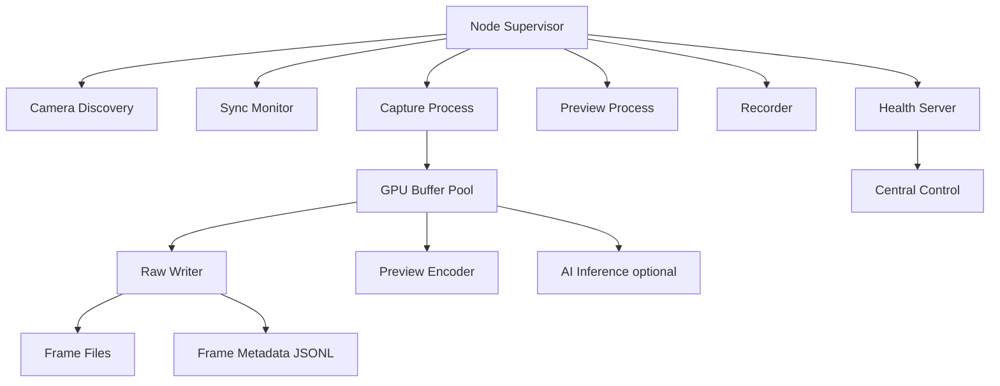

# 03 Software Architecture

## 1. 方針

ソフトウェアは、次の3系統に分ける。

| 系統 | 目的 | 優先度 |
|---|---|---:|
| Capture Master | RAWまたは低圧縮保存 | 最優先 |
| Preview and Monitor | 低遅延preview、状態監視 | 高 |
| Reconstruction Export | COLMAP、OpenMVG、OpenMVS、Nerfstudio、gsplat用変換 | 高 |

最初からリアルタイムvolumetricを作ろうとすると失敗する。最初に必要なのは、正しいデータを落とさず保存すること。

## 2. 推奨ソフトウェアstack

| Layer | 推奨 |
|---|---|
| OS | NVIDIA JetPackに含まれるUbuntu系Linux |
| Camera API | V4L2、Argus、vendor SDK |
| Stream | GStreamer |
| GPU buffer | NVMM、CUDA EGL interop |
| CV | OpenCV CUDA、NVIDIA VPI |
| AI | TensorRT、DeepStream、Holoscan検討 |
| Node control | Python、C++、gRPCまたはZeroMQ |
| Metadata | JSONL、SQLite、Parquet |
| Reconstruction | COLMAP、OpenMVG、OpenMVS、Nerfstudio、gsplat |
| Monitoring | Prometheus node exporter、custom health endpoint |
| Logs | structured JSON logs |

## 3. Node process構成



## 4. Capture process

### 要件

| 項目 | 条件 |
|---|---|
| camera enumeration | 起動時にcamera serial、port id、logical idを照合 |
| parameter lock | exposure、gain、fps、white balanceを固定 |
| frame id | FSYNC pulse単位のframe idを持つ |
| timestamp | hardware timestampとsystem timestampを両方保存 |
| drop detection | 欠落frameをmanifestに記録 |
| writer | cameraごとに独立writer queueを持つ |
| backpressure | 書き込み遅延時に明示的に警告、黙ってdropしない |

## 5. GStreamer方針

### Master保存

RAW保存はvendor driver依存。理想はV4L2からRAW bufferを取り出し、custom writerへ渡す。

### Preview

previewは低解像度でよい。GStreamerで各cameraを縮小し、mosaicを作る。

例としては以下の方向。

```bash
gst-launch-1.0 \
  nvarguscamerasrc sensor-id=0 ! \
  video/x-raw(memory:NVMM),width=1920,height=1200,framerate=30/1 ! \
  nvvidconv ! \
  video/x-raw(memory:NVMM),width=480,height=300 ! \
  nveglglessink
```

実際のelementはcamera vendor driverに依存する。AIはこのcommandをそのまま信じず、必ず該当cameraのsample pipelineから開始すること。

## 6. Zero copy方針

JetsonではCPU memoryとGPU memoryの往復を避ける。

| やるべき | 避けるべき |
|---|---|
| NVMM bufferを使う | 毎frameをCPUにmemcpyする |
| CUDA interop | OpenCV CPU処理に戻す |
| previewとAIをGPU上で分岐 | H264保存後にdecodeしてAI処理 |
| metadataは軽量に別保存 | frameごとに巨大JSONを混ぜる |

## 7. Recorder設計

### 保存単位

```
session_YYYYMMDD_HHMMSS/
  manifest.json
  node_001/
    camera_001/
      frames.rawpack
      frames.index.jsonl
    camera_002/
      frames.rawpack
      frames.index.jsonl
    node_log.jsonl
```

### rawpack方針

初期は単純な連結binaryでよい。

| フィールド | 説明 |
|---|---|
| magic | format識別 |
| version | format version |
| frame_id | 同期frame id |
| timestamp_hw | hardware timestamp |
| timestamp_ptp | PTP補正後timestamp |
| exposure_us | exposure |
| gain | gain |
| payload_offset | binary位置 |
| payload_size | frame bytes |
| checksum | 破損検出 |

## 8. Central control

中央制御はGUIより先にCLIとAPIを作る。

### Commands

| command | 動作 |
|---|---|
| discover | nodeとcameraを列挙 |
| arm | 撮影準備 |
| trigger | session開始 |
| stop | session停止 |
| health | 状態確認 |
| sync_test | LED flash testを実行 |
| export_colmap | COLMAP形式へ変換 |
| export_nerfstudio | Nerfstudio形式へ変換 |

## 9. Health monitoring

| metric | 意味 |
|---|---|
| camera_connected | cameraごとの接続状態 |
| fps_actual | 実fps |
| frame_drop_count | 欠落数 |
| writer_queue_depth | 書き込みqueue深度 |
| nvme_write_mbps | NVMe書き込み速度 |
| gpu_usage | GPU負荷 |
| cpu_usage | CPU負荷 |
| temp_jetson | Jetson温度 |
| temp_carrier | carrier温度 |
| sync_jitter_us | trigger jitter推定 |

## 10. 言語選定

| 部分 | 推奨言語 |
|---|---|
| capture core | C++ |
| node supervisor | PythonまたはRust |
| CLI | Python |
| metadata tools | Python |
| reconstruction automation | Python and bash |
| realtime GPU processing | C++ CUDA |
| visualization | Python、OpenGL、Unreal |

現実的には、最初はPythonでcontrol、C++でcapture coreがよい。全部Pythonで書くと高速I/Oで苦しくなる。全部C++で書くと開発速度が落ちる。
