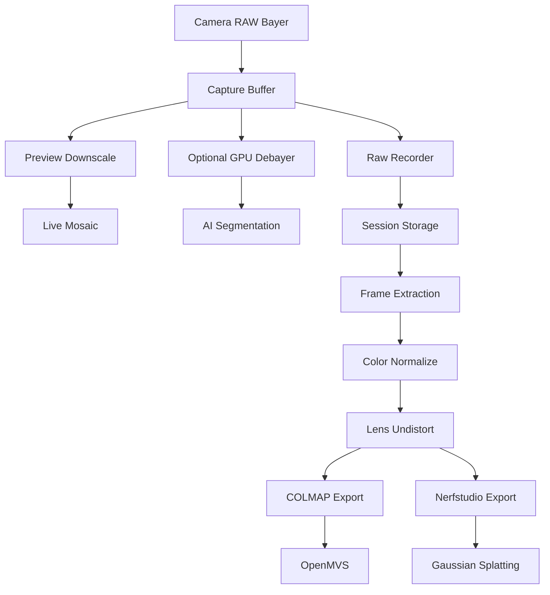

# 04 Data Pipeline

## 1. データを潰さない設計

Volumetric captureでは、後から再処理する価値が高い。最初の撮影データをH264だけで保存すると、将来の再構成、学習、Gaussian Splatting、depth推定の品質を捨てることになる。

## 2. Pipeline全体



## 3. 保存形式

### Master

| 形式 | 評価 | 用途 |
|---|---:|---|
| RAW10 rawpack | ◎ | 最優先master |
| RAW12 rawpack | ◎ | dynamic range優先 |
| FFV1 | ○ | 可逆圧縮video保存 |
| JPEG XL sequence | ○ | image sequence運用 |
| ProRes 4444 | △ | 編集連携には便利だが解析masterには弱い |
| H264 | × | preview用のみ |
| H265 | × | preview用のみ |

## 4. Metadata

### session manifest

session単位で以下を保存する。

| 項目 | 例 |
|---|---|
| session_id | 20260506_fil_volcap_test_001 |
| operator | daito |
| node_count | 1 |
| camera_count | 8 |
| fps | 30 |
| resolution | 1920 x 1200 |
| pixel_format | RAW10 |
| sync_mode | external_fsync |
| calibration_id | calib_20260506_001 |
| lighting_profile | studio_softbox_profile_001 |
| notes | ChArUco board test |

### camera metadata

| 項目 | 内容 |
|---|---|
| camera_id | logical camera id |
| serial | hardware serial |
| node_id | node id |
| port_id | GMSL2 port |
| lens_id | lens管理id |
| focal_length_mm | nominal focal length |
| aperture | fixed aperture |
| focus_distance_m | measured focus distance |
| exposure_us | fixed exposure |
| analog_gain | fixed gain |
| white_balance | fixed or disabled |

### frame metadata

| 項目 | 内容 |
|---|---|
| frame_id | FSYNC基準id |
| camera_id | camera id |
| timestamp_sensor_ns | sensor timestamp |
| timestamp_node_ns | node monotonic time |
| timestamp_ptp_ns | PTP補正後time |
| exposure_us | exposure |
| gain | gain |
| payload_offset | rawpack offset |
| payload_size | bytes |
| checksum | optional |
| dropped | true or false |

## 5. Directory layout

```
volcap_data/
  sessions/
    20260506_test_001/
      manifest.json
      calibration_snapshot.json
      lighting_snapshot.json
      nodes/
        node_001/
          node_manifest.json
          camera_001/
            frames.rawpack
            frames.index.jsonl
            preview.mp4
          camera_002/
            frames.rawpack
            frames.index.jsonl
          logs/
            capture.jsonl
            health.jsonl
      exports/
        colmap/
        openmvg/
        nerfstudio/
        gaussian_splatting/
```

## 6. タイムスタンプ設計

### 時刻の種類

| 種類 | 意味 | 信頼度 |
|---|---|---:|
| frame_id | FSYNC pulse番号 | 最高 |
| hardware timestamp | cameraまたはdriverの時刻 | 高 |
| ptp timestamp | ノード間比較用 | 中から高 |
| system timestamp | Linux user space取得時刻 | 中 |
| wall clock | 表示用 | 低 |

解析時のprimary keyはframe_id。wall clockを基準にしてはいけない。

## 7. Export to COLMAP

COLMAPへは、各cameraごとにframeをimageとして展開する。

### 静止物photogrammetry

全frameを使う必要はない。blurと露光のよいframeを選別する。

### 動体volumetric

同一frame_idの8枚を1つのmulti view setとして扱う。

```
exports/colmap/frame_000001/
  images/
    cam_001.png
    cam_002.png
    cam_003.png
  cameras.txt
  images.txt
  points3D.txt
```

## 8. Export to Nerfstudio

Nerfstudio用には以下が必要。

| ファイル | 内容 |
|---|---|
| images | undistortedまたはraw RGB images |
| transforms.json | camera pose、intrinsics |
| masks | optional segmentation mask |
| depth | optional depth priors |

初期はCOLMAPでpose推定してNerfstudioへ渡す。

## 9. Color pipeline

### 初期

1. 全カメラmanual exposure。
2. 全カメラmanual gain。
3. gray cardを撮影。
4. カメラごとの3x3 color correction matrixを推定。
5. 再構成export時に補正。

### 注意

自動露光と自動white balanceはvolumetric captureの敵。必ず固定する。

## 10. Data retention

| データ | 保存期間 | 理由 |
|---|---|---|
| RAW master | 長期 | 将来再処理価値が高い |
| preview mp4 | 短期または長期 | 確認用 |
| logs | 長期 | 問題再現に必要 |
| calibration | 長期 | 再構成に必須 |
| exported png | 必要時再生成 | masterから作れる |
